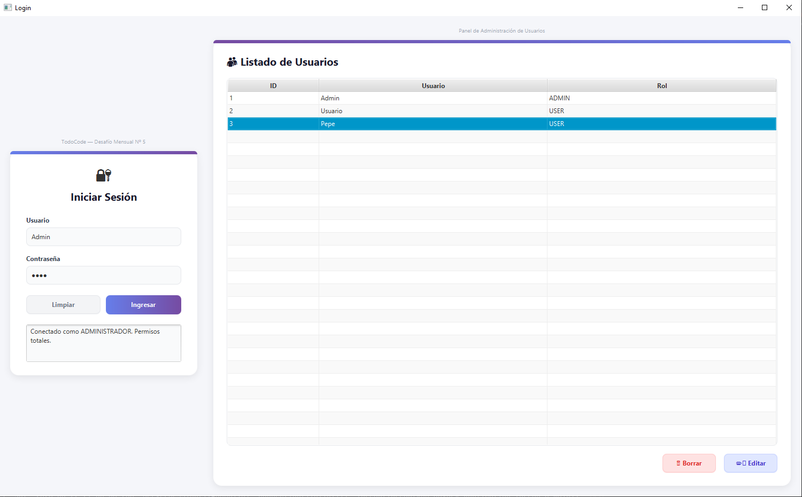

# 🔐 Sistema Login JavaFX — Gestión de Usuarios

Sistema de escritorio desarrollado en **Java + JavaFX** que implementa un login con autenticación por roles. Según el tipo de usuario que inicia sesión, se habilitan diferentes funcionalidades dentro del sistema.

> Ejercicios Integradores Nº 5 y Nº 6 — Curso de Programación Java (TodoCode)

---

## 📸 Vista de la aplicación



---

## ✨ Funcionalidades

### 🔑 Login
- Autenticación con usuario y contraseña
- Validación de credenciales contra la base de datos
- Redirección automática según el rol del usuario
- Mensaje de error si las credenciales son incorrectas

### 👑 Panel Administrador (`admin`)
- Visualización de **todos** los usuarios del sistema
- Alta, baja, modificación y lectura de cualquier usuario
- Gestión de roles y permisos
- Nombre del usuario logueado visible en pantalla

### 👤 Panel Usuario Común (`user`)
- Visualización de usuarios de su mismo tipo (solo lectura)
- Nombre del usuario logueado visible en pantalla

---

## 🛠️ Tecnologías utilizadas

| Tecnología | Versión | Rol |
|---|---|---|
| Java | 25 | Lenguaje principal |
| JavaFX | 21.0.6 | Interfaz gráfica |
| JPA / EclipseLink | 4.0.2 | Persistencia de datos |
| MySQL | 8.0+ | Base de datos |
| Maven | — | Gestión de dependencias |
| IntelliJ IDEA | 2025.x | IDE de desarrollo |

---

## 📁 Estructura del proyecto

```
src/main/
├── java/
│   ├── ejercicio.login.igu/              # Interfaz Gráfica de Usuario
│   │   ├── LoginApp.java                 # Punto de entrada JavaFX
│   │   ├── LoginController.java          # Controlador pantalla de login
│   │   ├── AdminController.java          # Controlador panel administrador
│   │   ├── UserController.java           # Controlador panel usuario común
│   │   └── Launcher.java                 # Launcher de la aplicación
│   ├── ejercicio.login.logica/           # Lógica de negocio
│   │   ├── Usuario.java                  # Entidad Usuario
│   │   └── Controladora.java             # Intermediario entre IGU y Persistencia
│   └── ejercicio.login.persistencia/     # Capa de acceso a datos
│       ├── UsuarioJPAController.java      # CRUD con JPA
│       └── ControladoraPersistencia.java  # Fachada de persistencia
└── resources/
    ├── ejercicio/login/igu/
    │   ├── login-view.fxml               # Pantalla de login
    │   ├── admin-view.fxml               # Panel administrador
    │   └── user-view.fxml                # Panel usuario común
    └── META-INF/
        └── persistence.xml               # Configuración JPA
```

---

## 🗺️ Arquitectura — Modelo de Capas

```
IGU  ──►  Controladora  ──►  ControladoraPersistencia  ──►  Base de datos
(Vista)    (Lógica)              (Persistencia / JPA)          (MySQL)
```

---

## 🧩 Entidad Usuario

| Campo | Tipo | Descripción |
|---|---|---|
| `id` | `Long` | Identificador único (autogenerado) |
| `nombre` | `String` | Nombre del usuario |
| `contrasena` | `String` | Contraseña |
| `rol` | `String` | Rol: `admin` o `user` |

---

## 🔄 Flujo de la aplicación

```
Login
  │
  ├── Credenciales incorrectas → Mensaje de error
  │
  ├── Rol: admin → Abre Panel Administrador
  │     └── CRUD completo de todos los usuarios
  │
  └── Rol: user  → Abre Panel Usuario
        └── Solo lectura de usuarios tipo "user"
```

---

## ⚙️ Requisitos previos

- [Java JDK 25](https://www.oracle.com/java/technologies/downloads/)
- [MySQL 8+](https://dev.mysql.com/downloads/)
- [Maven](https://maven.apache.org/)
- [IntelliJ IDEA](https://www.jetbrains.com/idea/) (recomendado)

---

## 🚀 Cómo ejecutar el proyecto

**1. Clonar el repositorio**
```bash
git clone https://github.com/RycardoMartynez/SistemaLoginJavaFX.git
cd SistemaLoginJavaFX
```

**2. Crear la base de datos en MySQL**
```sql
CREATE DATABASE logindb;
```

**3. Configurar credenciales en `persistence.xml`**

Editá `src/main/resources/META-INF/persistence.xml`:
```xml
<property name="jakarta.persistence.jdbc.url"
          value="jdbc:mysql://localhost:3306/logindb?useSSL=false&amp;serverTimezone=UTC"/>
<property name="jakarta.persistence.jdbc.user"     value="TU_USUARIO"/>
<property name="jakarta.persistence.jdbc.password" value="TU_CONTRASEÑA"/>
```

**4. Ejecutar**
```bash
mvn clean javafx:run
```

> Las tablas se crean automáticamente gracias a `eclipselink.ddl-generation = create-or-extend-tables`

**5. Insertar usuarios de prueba en MySQL**
```sql
INSERT INTO usuario (nombre, contrasena, rol) VALUES ('admin', '123Prueba', 'admin');
INSERT INTO usuario (nombre, contrasena, rol) VALUES ('user1', '123Prueba', 'user');
```

---

## 👨‍💻 Autor

**RycardoMartynez**
Proyecto desarrollado como Ejercicios Integradores Nº 5 y Nº 6 para el curso de **Programación en Java** — TodoCode.

---

## 📄 Licencia

Este proyecto es de uso educativo.
